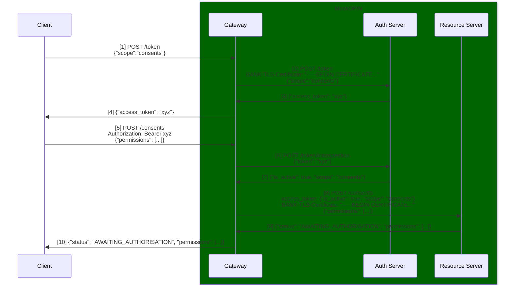

# Mock Insurance Open Source

This repository provides a fully local instance of **Mock Open Insurance**, including all components required to comply with Open Insurance (OPIN) standards and API specifications.

Certificates for the Certificate Authority and mTLS clients are located in [`mock-service-os/certs`](./mock-service-os/certs).

---

## Table of Contents

- [Prerequisites](#prerequisites)
- [Instructions for macOS / Linux](#instructions-for-macos--linux)
- [Instructions for Windows](#instructions-for-windows)
- [Obtaining a Token Using Certificates](#obtaining-a-token-using-certificates)

---

## Prerequisites

To run Mock Insurance OS, ensure the following tools are installed:

- **Java 17**
- **Gradle**
- **Docker**

---

Below are the steps to run and interact with Mock OPIN on your local machine.

If you're using macOS or Linux, refer to the [Instructions for macOS / Linux](#instructions-for-macos--linux).

If you're using Windows, refer to the [Instructions for Windows](#instructions-for-windows).


## Instructions for macOS / Linux

The following instructions cover how to run and interact with Mock OPIN on macOS or Linux, as well as how to configure and execute it together with the Conformance Suite.

### 1. Setup

Publish the local dependency that contains the API models used by Mock Insurance.

> This step is required only once.

```bash
make setup
```

### 2. Configure Local Hosts

Add the following entries to your hosts file to create aliases for localhost:

```bash
127.0.0.1 auth.local
127.0.0.1 api.local
127.0.0.1 directory
```

### 3. Run the Environment

To run a fully local instance, start all components using Docker:

```bash
make run
```

### 4. Run with Conformance Suite

To run a fully local instance with the Conformance Suite, you need to start all components, along with the Conformace Suite itself.

1. Run the command below to set up the Conformance Suite:

   ```bash
   make setup-cs
   ```

2. Then start the environment with:

   ```bash
   make run-with-cs
   ```

3. Once running, you can access the environment via:

   ```
   https://localhost:8443
   ```

Configuration for the tests is available in the `cs_config.json` file.

---

## Instructions for Windows

> ⚠️ These instructions assume you're using a Linux-compatible terminal such as **WSL** (Windows Subsystem for Linux) or **Git Bash**.

The following instructions cover how to run and interact with Mock OPIN on Windows, as well as how to configure and execute it together with the Conformance Suite.

### 1. Setup

Publish the local dependency that contains the API models used by Mock Insurance.

> This step is required only once.

```bash
make setup
```

### 2. Configure Local Hosts

Add the following entries to your hosts file to create aliases for localhost:

```bash
127.0.0.1 auth.local
127.0.0.1 api.local
127.0.0.1 directory
```

### 3. Run the Environment

To run a fully local instance, start all components using Docker:

```bash
make run
```

Wait for the containers to be fully initialized, then stop them before continuing to the next step.

### 4. Modify the Makefile in Order to Run with Conformance Suite

1. In the root `Makefile`, locate the `setup-cs` section, related to cloning the Conformance Suite repository and initial setup, and do the following:

   - **Comment out** line 15 (which builds the Conformance Suite)
   - **Keep only** lines 11, 12, and 13 in `setup-cs`

2. Save the file, then run:

   ```bash
   make setup-cs
   ```

3. Edit the same `Makefile` again:
   - **Uncomment** line 15
   - **Comment out** lines 11, 12, and 13 (to avoid re-downloading)

4. Save and run the command again to set up the conformance suite:

   ```bash
   make setup-cs
   ```

### 5. Run with Conformance Suite

1. Then start the environment with:

   ```bash
   make run-with-cs
   ```
   
2. Once running, you can access the environment via:

   ```
   https://localhost:8443
   ```

Configuration for the tests is available in the `cs_config.json` file.

### 6. (Optional) Fix Dockerfile Issues
In some environments, Docker may fail to locate the `buster` image. If this occurs:

1. Edit the following three `Dockerfile` files inside the `conformance-suite` folder as it follows:
   - 
   - 
   - 
2. Ensure they are pointing to valid base images (e.g., replace `buster` with an available image that matches your environment).
3. Return to step [5. Run with Conformance Suite](#5-run-with-conformance-suite)

---

## Obtaining a Token Using Certificates

To request a token using the client certificate:

```bash
curl -v \
  --cert ./mock-service-os/certs/client_one.crt \
  --key ./mock-service-os/certs/client_one.key \
  --cert-type PEM \
  --key-type PEM \
  -u client:1234 \
  -d "grant_type=client_credentials&scope=openid" \
  -H "Content-Type: application/x-www-form-urlencoded" \
  https://auth.local/token -k
```

To introspect the token:

```bash
curl -v \
  --cert ./mock-service-os/certs/client_one.crt \
  --key ./mock-service-os/certs/client_one.key \
  --cert-type PEM \
  --key-type PEM \
  -u client:1234 \
  -d "token=your_access_token" \
  -H "Content-Type: application/x-www-form-urlencoded" \
  https://auth.local/token/introspection -k
```

## Architecture Design

The system is composed of three main components: the Authorization Server (AS), the Resource Server (RS), and the Gateway (GW), which together form the MockOPIN architecture.

### Gateway

Implemented in Go under mock-service-os/mock_mtls, the gateway intercepts all incoming requests.

It is responsible for:
* Handling mTLS connections.
* Extracting and forwarding client certificate details.
* Introspecting access tokens via the Authorization Server.
* Forwarding validated requests to secured endpoints on behalf of the client.

### Authorization Server

Located at mock-service-os/mock_as, this Node.js service leverages the node-oidc-provider library.

Its primary responsibilities include:
* Managing OAuth2/OpenID Connect logic.
* Handling client registration, user authentication, and token issuance.
* Exposing the /token, /introspection, and related endpoints.

### Resource Server
Implemented in Java (Micronaut) under insurance-server-lambdas, the Resource Server exposes the Open Insurance API endpoints.

It:
* Consumes access tokens received from the gateway.
* Enforces scope-based authorization.
* Executes the business logic for endpoints such as /consents, /customers, and /policies.

### End-to-End Consent Creation Flow

The following diagram illustrates the detailed flow for creating a consent in the MockOPIN architecture:



1. The client establishes an mTLS connection and requests a token:
   ```
   POST matls-auth.local/token
   ```
   ```json
   {
      "client_assertion": "ey...",
      "client_assertion_type": "urn:ietf:params:oauth:client-assertion-type:jwt-bearer",
      "grant_type": "client_credentials",
      "scope": "consent"
   }
   ```

2. The Gateway intercepts the connection, extracts the certificate, and forwards it to the Authorization Server:
   ```
   POST auth:3000/token
   BANK-TLS-Certificate: -----BEGIN CERTIFICATE...
   X-BANK-Certificate-DN: ...
   X-BANK-Certificate-Verify: SUCCESS
   ```
   ```json
   {
      "client_assertion": "ey...",
      "client_assertion_type": "urn:ietf:params:oauth:client-assertion-type:jwt-bearer",
      "grant_type": "client_credentials",
      "scope": "consent"
   }
   ```

3. The Authorization Server validates the request and issues an access token:
   ```json
   {
      "access_token": "xyz",
      "expires_in": 3600,
      "token_type": "bearer"
   }
   ```

4. The Gateway forwards the response back to the client unchanged.

5. The client then makes a new mTLS request to create a consent:
   ```
   POST matls-api.local/open-insurance/consents/v2/consents
   Authorization: Bearer xyz
   ```
   ```json
   {
      "permissions": [],
   }
   ```

6. The Gateway introspects the access token with the Authorization Server:
   ```
   POST auth:3000/token/introspection
   ```
   ```json
   {
      "token": "xyz"
   }
   ```

7. The Authorization Server responds with the token status:
   ```json
   {
      "is_active": true,
      "scope": "consents"
   }
   ```

8. The Gateway forwards the validated token content and client certificate to the Resource Server:
   ```
   POST mockapi:8080/token
   BANK-TLS-Certificate: -----BEGIN CERTIFICATE...
   X-BANK-Certificate-DN: ...
   X-BANK-Certificate-Verify: SUCCESS
   access_token: {"is_active":true,"scope":"consents"}
   ```
   ```json
   {
      "permissions": [],
   }
   ```

9. The Resource Server processes the request, authorizes based on the token scope, and responds.
   ```json
   {
      "status": "AWAITING_AUTHORISATION",
      "permissions": []
   }
   ```

10. The Gateway forwards the final response to the client unchanged.
   ```json
   {
      "status": "AWAITING_AUTHORISATION",
      "permissions": []
   }
   ```

### Cloud Architecture
Although the project was originally designed and deployed on AWS, its components are largely cloud-agnostic and can be adapted to other providers (such as Azure) with minimal changes.

The primary cloud-specific dependency is how the Authorization Server retrieves its configuration parameters.
In the current implementation, configuration is fetched from AWS SSM Parameter Store, as defined in: `mock-service-os/mock_as/express.js`.

For local development, this behavior is replicated using LocalStack, provisioned via `mock-service-os/setup_ssm.sh`.

When deploying to another cloud provider, the only required adjustment is replacing the SSM parameter-loading logic with that provider’s equivalent service (e.g., Azure App Configuration, GCP Secret Manager, or simple environment variables).
